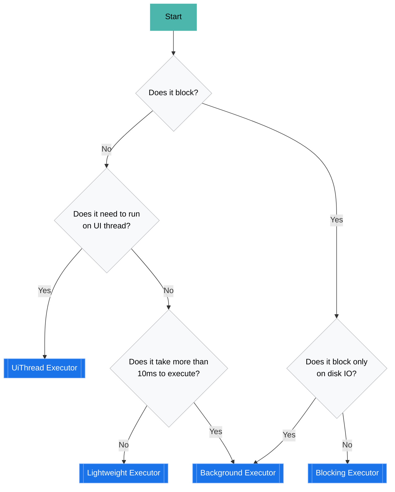

# Some Page

Hello world!

```mermaid
flowchart TD
    Start[Start] --> DoesBlock{Does it block?}
    DoesBlock -->|No| NeedUi{Does it need to run\n on UI thread?}
    NeedUi --> |Yes| UiExecutor[[UiThread Executor]]
    NeedUi --> |No| TakesLong{Does it take more than\n 10ms to execute?}
    TakesLong --> |No| LiteExecutor[[Lightweight Executor]]
    TakesLong --> |Yes| BgExecutor[[Background Executor]]
    DoesBlock --> |Yes| DiskIO{Does it block only\n on disk IO?}
    DiskIO --> |Yes| BgExecutor
    DiskIO --> |No| BlockExecutor[[Blocking Executor]]
    
    
    classDef start fill:#4db6ac,stroke:#4db6ac,color:#000;
    class Start start
    
    classDef condition fill:#f8f9fa,stroke:#bdc1c6,color:#000;
    class DoesBlock condition;
    class NeedUi condition;
    class TakesLong condition;
    class DiskIO condition;
    
    classDef executor fill:#1a73e8,stroke:#7baaf7,color:#fff;
    class UiExecutor executor;
    class LiteExecutor executor;
    class BgExecutor executor;
    class BlockExecutor executor;
```